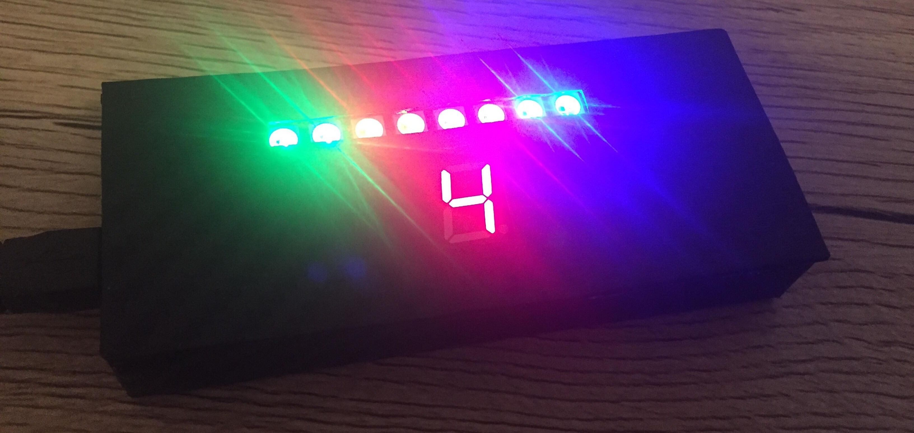
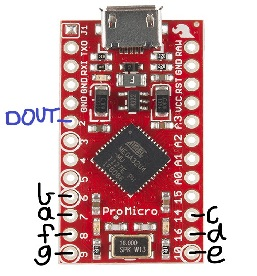

# RaceTelemetry
Interface an Adafruit NeoPixel Strip and a 7 Segment Display with F1 2017 to display the rev limiter and current gear of the car using an Arduino Pro Micro.

# Project files
RaceTelemetry.cpp is the main project file which creates a UDP server to receive data from the UDP client in the F1 2017 racing game.
After receiving new data, this file will then send serial data through USB using the SerialPort.h library to the Arduino with RaceTelemetry.ino uploaded.

# Getting started
1.  Connect your Arduino and open the Arduino IDE.
2.  Compile and upload RaceTelemetry.ino, noting the COM port used.
3.  Change PORT_NAME to the COM port your Arduino is connected to.
4.  Build and compile the RaceTelemetry solution.
5.  Run the program, and open an F1 2017 session.

# Environment
The RaceTelemetry solution was created in Visual Studio 2017 RC (v141 toolset) on Windows 10, hence Winsock.h was the primary library for creating the server.
The Arduino sketch was created in Arduino IDE 1.0.6.